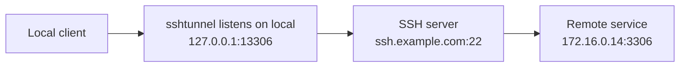
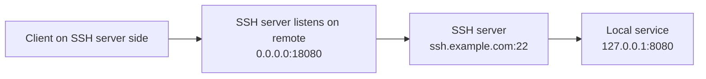
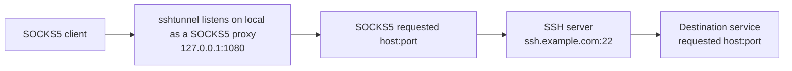

# SSH Tunnel

[](https://github.com/c3b2a7/sshtunnel/blob/master/LICENSE)


`sshtunnel` is a small SSH tunneling CLI for local forwarding, remote
forwarding, and dynamic SOCKS5 forwarding. It starts one SSH connection and
runs one or more tunnels from a JSON config file.

## Features

- Local, remote, and dynamic SSH forwarding.
- Multiple tunnels over one SSH connection.
- Private key, SSH agent socket, and password authentication.
- JSON configuration for repeatable tunnel setups.

## Installation

Install with the release script:

```shell
curl -sSfL https://get.lolico.me/sshtunnel | sh
```

Show installer options:

```shell
curl -sSfL https://get.lolico.me/sshtunnel | sh -s -- -h
```

Install from source:

```shell
go install github.com/c3b2a7/sshtunnel@latest
```

Prebuilt archives are available on the [releases page](https://github.com/c3b2a7/sshtunnel/releases).

## Quick Start

Create a config file:

```json
{
  "target": "ssh.example.com:22",
  "username": "alice",
  "private-key": "/home/alice/.ssh/id_ed25519",
  "passphrase": "private key passphrase",
  "tunnels": [
    {
      "mode": "local",
      "local": "127.0.0.1:13306",
      "remote": "172.16.0.14:3306"
    },
    {
      "mode": "remote",
      "local": "127.0.0.1:8080",
      "remote": "0.0.0.0:18080"
    },
    {
      "mode": "dynamic",
      "local": "127.0.0.1:1080"
    }
  ]
}
```

Start the tunnels:

```shell
sshtunnel -config /path/to/config.json
```

Enable debug logs when needed:

```shell
sshtunnel -config /path/to/config.json -verbose
```

After the sample config is running:

```shell
# local forwarding: connect to remote MySQL through localhost
mysql -h 127.0.0.1 -P 13306 -u root -p

# remote forwarding: connect from the SSH server side to your local service
nc -l 8080
nc localhost 18080

# dynamic forwarding: use the local SOCKS5 proxy
curl -x socks5://127.0.0.1:1080 ip.sb
```

## Usage

```text
Usage of sshtunnel:
  -config string
        config file
  -v    show version information
  -verbose
        verbose mode
```

## Configuration

**Top-level fields:**

| Field           | Required | Description                                                                                                                                                         |
|-----------------|----------|---------------------------------------------------------------------------------------------------------------------------------------------------------------------|
| `target`        | Yes      | SSH server address, in `host:port` format.                                                                                                                          |
| `username`      | Yes      | SSH username.                                                                                                                                                       |
| `private-key`   | No       | Path to an SSH private key. When set, it is tried first as a public key authentication source.                                                                      |
| `ssh_auth_sock` | No       | Unix socket path for SSH agent authentication. Agent identities are tried after `private-key`; if unset, the fallback is `SSH_AUTH_SOCK` read from the environment. |
| `passphrase`    | No       | Private key passphrase when `private-key` is set; otherwise the SSH password, tried after public key authentication.                                                |
| `tunnels`       | Yes      | List of tunnel definitions.                                                                                                                                         |

**Tunnel definitions:**

| Field    | Required                 | Description                                                                                      |
|----------|--------------------------|--------------------------------------------------------------------------------------------------|
| `mode`   | Yes                      | One of `local`, `remote`, or `dynamic`.                                                          |
| `local`  | Yes                      | Local listen address for `local` and `dynamic`; local target service for `remote`.               |
| `remote` | For `local` and `remote` | Remote target service for `local`; SSH server listen address for `remote`. Ignored by `dynamic`. |

## Authentication order:

`private-key` public key auth -> `ssh_auth_sock` agent auth -> `SSH_AUTH_SOCK` (from environment variable) agent auth ->
`passphrase` password auth

`passphrase` has two meanings:

- When `private-key` is set, `passphrase` is the private key passphrase.
- When `private-key` is not set, `passphrase` is used as the SSH password after public key authentication.

## Forwarding Modes

| Mode      | Use case                                       |
|-----------|------------------------------------------------|
| `local`   | Reach a remote service from your machine.      |
| `remote`  | Expose a local service on the SSH server side. |
| `dynamic` | Use the SSH server as a SOCKS5 proxy.          |

Traffic flow diagrams are hidden by default. Expand them when you need the
connection path for a specific mode.

<details>
<summary>Show traffic flow diagrams</summary>

### Local Forwarding



### Remote Forwarding



### Dynamic Forwarding



</details>

## License

MIT
